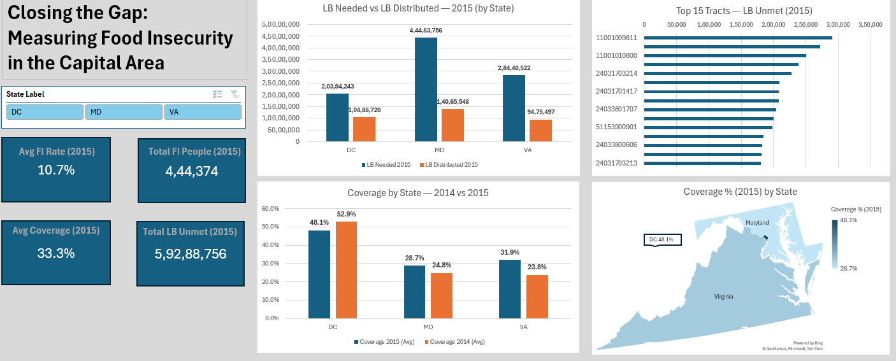

# Closing the Gap: Measuring Food Insecurity in the Capital Area

An Excel dashboard analyzing food insecurity and food bank service coverage across DC, Maryland, and Virginia (2014–2015), built on Capital Area Food Bank (CAFB) tract-level hunger estimates.

## Dashboard Preview

## Overview

This project tracks the gap between food *needed* and food *distributed* at the census-tract level across the DC–MD–VA region, then rolls it up to state and region views.

## 2015 KPI Snapshot

- **Avg FI Rate:** 10.7%
- **Total FI People:** 444,374
- **Avg Coverage:** 33.3%
- **Total LB Unmet:** 59,288,756

**Region totals (2015):** 93.3M lb needed · 34.0M lb distributed · 59.3M lb unmet

## Files

| File | Description |
|---|---|
| `CAFB_Dashboard.xlsx` | The full workbook — source data, calculations, pivots, and dashboard |
| `CAFB_HungerEstimates_Source_Data.csv` | Raw tract-level hunger estimates (source data) |

## Data & Method

- Tract-level CAFB hunger estimates for 2014 and 2015
- **2014 Pounds Needed** reconstructed as `Distributed + Unmet` (not present in the original source)
- **Coverage** = `Distributed / Needed`
- Two PivotTables drive the visuals: state rollup and Top-15 unmet tracts
- A filled map summarizes 2015 coverage by state

## Charts

1. **LB Needed vs LB Distributed — 2015 (by State)**
2. **Top 15 Tracts — LB Unmet (2015)**
3. **Coverage by State — 2014 vs 2015**
4. **Coverage % (2015) by State** (filled map)

## State Detail (2015)

| State | LB Needed | LB Distributed | Coverage (Avg) |
|---|---|---|---|
| DC | 20,394,243 | 10,488,720 | 48.1% |
| MD | 44,483,756 | 14,065,548 | 28.7% |
| VA | 28,440,522 | 9,475,497 | 31.9% |

## Key Findings

1. Region totals (2015): 93.3M lb needed; 34.0M lb distributed; 59.3M lb unmet.
2. Average tract FI rate ≈ 10.7%; average coverage ≈ 33.3% across DC–MD–VA.
3. Need exceeds distribution in all three states — by pounds, Maryland shows the largest gap.
4. DC has the highest average coverage; MD the lowest on average; VA sits between.
5. Coverage trend (2014 → 2015): DC 52.9% → 48.1%, MD 24.8% → 28.7%, VA 23.8% → 31.9%.
6. The Top-15 Unmet chart flags specific tract GEOIDs to prioritize for additional supply.
7. Unmet per person varies widely by tract, revealing inequities that state averages hide.

## Source

Dataset based on Capital Area Food Bank (CAFB) hunger estimates.

## Requirements

- Microsoft Excel (PivotTables and filled maps used in the dashboard)
